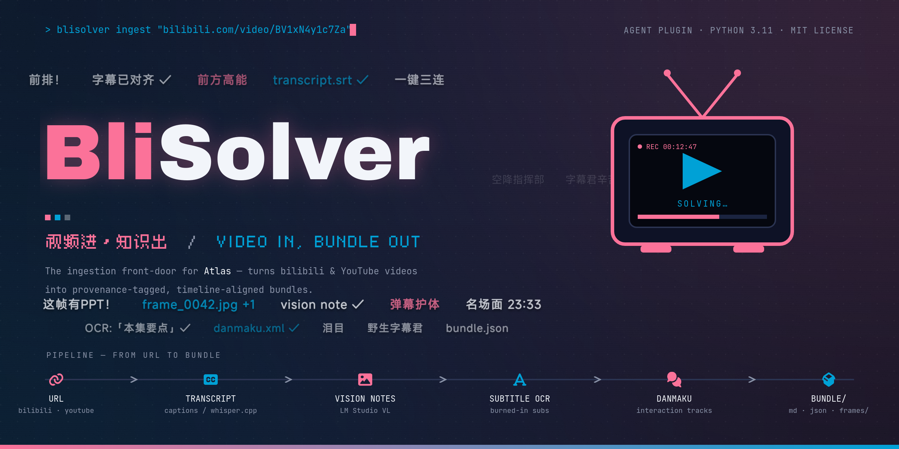

<div align="center">
  
  <br>
  <p>
    <a href="README.md">English</a> | <a href="README_zh.md">简体中文</a>
  </p>
</div>

---

## Agent 从这里开始

**使用本仓库处理视频前，先读取 [blisolver-video-ingestion / SKILL.md](skills/blisolver-video-ingestion/SKILL.md)。**
它给出运行时检查、探针、转录和产物验收的顺序；每一步只读取对应 reference，不要一次读完整个文档树。
修改源码时同时遵守 [AGENTS.md](AGENTS.md)。

- **刚 clone：** 直接读取上面的 Skill 即可开始；支持项目 Skill 的客户端还可发现
  `.agents/skills/blisolver-video-ingestion`，它链接到同一份权威内容。
- **安装插件：** 在支持 Agent Plugins 的客户端中安装/启用本仓库根目录。仅 clone 或连接 MCP
  不等于安装 Skill；安装后检查客户端的技能目录，必要时刷新会话。
- **仅连接 MCP：** 按服务 instructions 读取 `blisolver://guidance/SKILL.md`，再读取当前阶段的
  resource；本地预检使用 `blisolver://runtime/doctor.json`。不要猜测工具名称或参数。

客户端兼容性、目录层级与发现失败的处理见 [Agent 发现说明](skills/blisolver-video-ingestion/references/agent-discovery.md)。

**BliSolver** 是为 **bilibili.com** 和 **YouTube** 打造的强大视频摄取工具（受上游 Harvest 启发）。给定一个视频 URL，它能生成一个时间轴对齐、自包含的**数据包 (Bundle)**：

- 📝 **原声字幕** (复用平台高可信字幕，或降级使用 whisper.cpp 离线转录)
- 🖼️ **逐帧视觉笔记** (通过本地视觉大模型实现 OCR + 图表/幻灯片描述)

它的流程始于 URL，终于 `out/<安全的视频标题> [<id>-p<part>]/` 目录，其中包含 `bundle.md`、`bundle.json` 和 `frames/`。它**不会**在当前阶段做总结或实体提取 —— 这些工作交由下游的 Atlas 处理。

详细设计请参见 [SPEC.md](SPEC.md)，向 Atlas 交付的数据契约请参考 [PROTOCOL.md](PROTOCOL.md)。

## 🌟 为什么需要专属工具？

数据源的获取是最困难的环节，且各平台差异巨大：
- **Bilibili** 对普通爬虫有严格限制（直接访问 `bilibili.com/video/…` 会返回 HTTP 412；无 `Referer` 时流/字幕 URL 报 403；大部分内容需要登录 Cookie），且不会向 yt-dlp 暴露其 AI 字幕。
- **YouTube** 相对友好，但仍需谨慎处理原声字幕的选择。

BliSolver 将每个数据源封装在一个 **Provider (提供程序)** 背后，最终转化为结构统一、干净利落的数据包。

## 🛠️ 环境要求

- **Python 3.11+**
- **ffmpeg** 需要在环境变量 PATH 中（被 yt-dlp 和帧提取阶段依赖）。
- **JavaScript 运行时** (推荐 **deno**，或 node) 用于 **YouTube** — yt-dlp 需要它来驱动 YouTube 真实的 Web 播放器客户端。可从 PATH 自动检测，或检查标准安装位置。
- **NVIDIA GPU** 或 **Apple Silicon** (Metal) 用于加速 Whisper 转录。
- **LM Studio** 仅视觉标注阶段需要，并加载视觉模型 (VL) 及其 mmproj；纯文本使用 `--no-vision --no-frame-images`。
- **授权 (分数据源):**
  - **Bilibili:** 一个已登录的 **Chrome** 浏览器配置（默认；可用 `BLISOLVER_COOKIES_BROWSER` 覆盖），或使用 `SESSDATA` 作为备用方案。
  - **YouTube:** 公开视频无需授权；对于年龄限制或机器人检测视频，可选配置浏览器配置文件。

## 📦 安装与配置

两条路径都可用。注意 `uv venv` **不会**把 `pip` 装进环境，所以走 uv 时要用 `uv pip`，而不是
`<venv>/bin/pip`。

```bash
git clone https://github.com/Golenspade/BliSolver.git && cd BliSolver

# 使用 uv
uv venv .venv
uv pip install --python .venv/bin/python -e ".[mcp,frames,vision]"

# 或使用标准库 venv
python3 -m venv .venv
.venv/bin/pip install -e ".[mcp,frames,vision]"

test -f .env || cp .env.example .env
.venv/bin/blisolver doctor          # 在为媒体处理花钱之前先看清哪些能力就绪
```

**没有 `transcribe` extra。** 本地 ASR 走的是 whisper.cpp——外部的 `whisper-cli` 可执行文件加一份
GGML 权重文件，两者都不是 Python 包。`doctor` 会分别检查二进制和权重，缺权重时会直接给出下载命令。

> **注意：** 在 `.env` 中配置 LM Studio 接口地址/模型，以及各数据源的授权变量。请勿提交您的 `.env` 文件。

## 🔌 作为 Agent Plugin 使用

**这个仓库本身就是一个 [Agent Plugin](https://agent-plugins.org)** —— `plugin.json` 位于根目录、与应用
并存，兼容的客户端可以直接加载其中的 skill 和 MCP 服务：

```text
BliSolver/
├── AGENTS.md        # repository agent entry
├── .agents/skills/blisolver-video-ingestion -> ../../skills/blisolver-video-ingestion
├── plugin.json      # Agent Plugins 1.0.0 清单
├── mcp.json         # 一个 stdio MCP 服务
├── bin/blisolver-mcp
├── blisolver/       # 应用本体
└── skills/
    └── blisolver-video-ingestion/   # SKILL.md、references/、scripts/
```

**安装方式由客户端定义。** Agent Plugins 规范只标准化目录形状，**刻意**把分发、安装、启用留给各客户端，
所以不存在通用安装命令。clone 本仓库，然后把这个目录交给你的客户端 —— 各客户端的具体配置见
[Compatible Clients](https://agent-plugins.org/compatible-clients)（撰写时为 Cursor、GitHub
Copilot、Hermes Agent、Kiro、VS Code）。

接线前有两件事值得先知道：

- **MCP 服务需要一个装了依赖的解释器。** `mcp.json` 执行 `./bin/blisolver-mcp`，它按
  `$BLISOLVER_PYTHON` → `$PLUGIN_DATA/venv/bin/python` → `<plugin-root>/.venv/bin/python` →
  PATH 上已安装的 `blisolver` 依次解析。先完成上面的安装步骤，否则服务会退出并打印建环境的命令。
- **凭据不放在清单里。** 规范把配置中的 `env` 值视为可见的包数据，而 `mcp.json` 是要提交的，所以
  `SESSDATA` 和 `LMSTUDIO_API_KEY` 必须来自环境变量或 `.env`。如果客户端清洗了环境变量，服务启动后
  可能无法取得需要登录的字幕；字幕不可用时会退回 Whisper，是否成功仍取决于本地 ASR。

`mcp.json` 把 `BLISOLVER_DATA_DIR` 设为 `${PLUGIN_DATA}`，因此缓存和产物落在客户端管理的数据目录里，
插件更新后仍然保留。

## 🚀 使用方法

```bash
blisolver ingest <url> [选项]
blisolver probe  <url>
blisolver doctor [--json]
blisolver mcp
```

### 常用选项

| 标志参数 | 描述 |
|------|-------------|
| `--part N` | 处理指定的分 P (从 1 开始) |
| `--all-parts` | 处理所有可用的分 P (Bilibili) |
| `--force-whisper` | 跳过复用字幕，强制使用本地模型转录 |
| `--lang CODE` | 指定音频实际语言；不是对话语言或翻译目标，详见 Skill 的 CLI 契约 |
| `--robust` | 禁用 `condition_on_previous_text` (适合重复性幻灯片课程) |
| `--no-vision` | 跳过画面帧视觉标注 |
| `--dedup-threshold N` | 用于去重的 pHash 汉明距离阈值 (默认值: 10) |
| `--no-frame-images` | 不在 `out/` 输出 PNG 图片文件 (依然保留图片描述文本) |
| `--ocr` / `--force-ocr` | 执行硬字幕 (内嵌字幕) 的 OCR 提取 |
| `--danmaku` | 抓取 Bilibili 弹幕轨道 |
| `--interactions` | 抓取 Bilibili 互动投票和评分 |

### 🔍 探针 (Probe)

`probe` 仅接收 URL 并打印一行的 JSON 格式 `ProbeResult` (包含标题、UP主、时长、分P、`original_language` 原声语言及 `available_subtitles` 所有可选字幕轨)。该功能使上层 Agent 能在 `ingest` 摄取前准确预估工作量。

## 📖 输出格式

产物将被写入：`out/<安全的视频标题> [<id>-p<part>]/`

- `bundle.md`: 交付给 Atlas 的核心产物 (包含来源元数据 + 与时间轴对应的字幕/视觉笔记)
- `bundle.json`: 精准的后台 JSON 记录 (契约详见 PROTOCOL.md)
- `frames/`: 包含视觉抽帧 PNG 图片的目录

### 字幕提取策略

- **Bilibili:** 优先选择人工或 AI 字幕并经过质量门限过滤；如无有效字幕则降级使用 Whisper。复用的自动字幕将标注为 `auto-sub`。
- **YouTube:** 遵循优先级 `human-sub > auto-sub > whisper`。优先获取对应原声语言的人工字幕。
